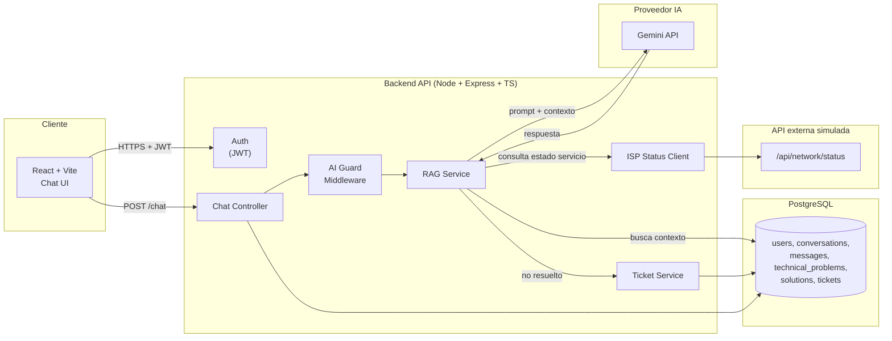

# Arquitectura de ClickIA

> Asistente inteligente de soporte técnico para proveedores de Internet (ISP).

## 1. Visión general

ClickIA es una plataforma de tres capas (frontend, backend, IA) más una base de
datos relacional, diseñada para diagnosticar problemas de conectividad de
usuarios finales mediante un chat conversacional, usando **RAG (Retrieval
Augmented Generation)** sobre una base de conocimiento propia en vez de dejar
que el modelo "invente" soluciones.



## 2. Stack tecnológico y justificación

| Capa | Tecnología | Por qué |
|---|---|---|
| Frontend | React + Vite + TypeScript | Build rápido, tipado fuerte, ecosistema maduro para SPA tipo chat |
| Estilos | Tailwind CSS | Consistencia visual rápida sin CSS a medida por componente |
| Estado remoto | React Query + Axios | Cache, reintentos y estados de carga/error sin boilerplate manual |
| Backend | Node.js + Express + TypeScript | Mismo lenguaje que el frontend, tipado compartido, ecosistema npm para JWT/bcrypt/rate-limit |
| Base de datos | PostgreSQL | Relacional, transaccional, ideal para el modelo users→conversations→messages→tickets |
| IA | Groq / Gemini (RAG), intercambiables | `AiProvider` es una interfaz; ambos clientes la implementan y se autodetecta cuál usar según qué API key esté configurada — se cambió de Gemini a Groq en producción sin tocar el resto del sistema cuando se agotaron los créditos de Gemini |
| APIs externas 2 y 3 | Open-Meteo (clima) + ip-api.com (ISP por IP) | Ninguna requiere API key; ambas se usan como señales reales de diagnóstico (clima severo / red distinta a la contratada), no como llamadas aisladas, y sus datos se persisten en `diagnostics` |
| Auth | JWT + refresh tokens + bcrypt | Estándar stateless para APIs REST, escalable horizontalmente |
| Docs API | OpenAPI/Swagger | Contrato explícito entre frontend y backend, generable desde el código |
| Contenedores | Docker + docker-compose | Entorno reproducible (frontend, backend, postgres) igual en dev y despliegue |

**Decisión clave:** el backend nunca deja que el LLM "decida" la solución desde
cero. El `RAG Service` primero consulta `technical_problems` + `solutions` en
PostgreSQL y el estado real del servicio vía la API ISP simulada, arma un
contexto, y solo entonces se lo pasa al LLM con instrucciones de responder
**basado únicamente en ese contexto**. Esto evita alucinaciones y hace que el
sistema sea auditable (se puede loguear qué contexto recibió el modelo).

## 3. Estructura de carpetas (monorepo)

```
ClickIA/
├── backend/
│   └── src/
│       ├── config/        # env, conexión DB, cliente LLM
│       ├── controllers/   # capa HTTP (req/res), sin lógica de negocio
│       ├── services/      # lógica de negocio (RAG, diagnóstico, tickets)
│       ├── repositories/  # acceso a datos (queries SQL), única capa que toca la DB
│       ├── models/        # tipos/entidades TypeScript
│       ├── routes/        # definición de endpoints Express
│       ├── middleware/    # auth, ai-guard, rate-limit, error handler
│       ├── validators/    # esquemas de validación de entrada (zod/joi)
│       ├── utils/         # helpers puros
│       ├── database/      # migraciones y seeds
│       └── app.ts
├── frontend/
│   └── src/
│       ├── components/    # componentes reutilizables (Button, ChatBubble, ...)
│       ├── pages/         # Login, Dashboard, Chat, Tickets
│       ├── hooks/         # hooks de React Query por recurso
│       ├── services/      # clientes Axios por dominio
│       ├── context/       # AuthContext, etc.
│       ├── types/         # tipos compartidos con el backend
│       └── App.tsx
├── docker/                # Dockerfiles y configuración de despliegue
├── docs/                  # ARCHITECTURE.md, ERD.md, manuales
└── docker-compose.yml
```

**Regla de capas en backend:** `controller → service → repository → DB`.
Un controller nunca ejecuta SQL directo; un service nunca conoce `req`/`res`.
Esto permite testear `services` sin levantar Express, y cambiar de ORM/driver
sin tocar controllers.

## 4. Flujo de diagnóstico (máquina de estados)

1. **Usuario reporta problema** → `POST /chat` con el mensaje.
2. **AI Guard** valida longitud, contenido y rate limit antes de procesar.
3. **Clasificación de categoría** → se identifica a qué `technical_problems`
   pertenece (ej. "sin conexión", "wifi lento").
4. **Consulta de base de conocimiento** → se traen `solutions` asociadas.
5. **Consulta de estado del servicio** → `GET /api/network/status` (API ISP
   simulada) para saber si hay mantenimiento en la zona del usuario.
6. **Generación de respuesta** → el contexto (problema + soluciones + estado
   de red) se envía al LLM, que redacta la respuesta guiada paso a paso.
7. **Resolución o escalamiento** → si el usuario indica que no se resolvió,
   se crea un `ticket` con la conversación como contexto.

## 5. Estrategia de ramas Git

- `main` — código estable, desplegable.
- `develop` — integración de features antes de pasar a `main`.
- `feature/auth`, `feature/chat-ai`, `feature/tickets`, `feature/dashboard` —
  una rama por feature, mergeada a `develop` vía PR.

Convención de commits: `feat:`, `fix:`, `docs:`, `refactor:`, `test:`,
`chore:` (Conventional Commits).

## 6. Estado de las fases

- **Fase 1:** arquitectura y diseño. ✅
- **Fase 2:** modelo de datos PostgreSQL + ERD + migraciones. ✅
- **Fase 3:** backend (capas, endpoints REST, API ISP simulada). ✅
- **Fase 4:** integración IA (RAG con LLM intercambiable). ✅
- **Fase 5:** frontend (chat, login, dashboard). ✅
- **Fase 6:** seguridad (JWT, AI Guard, hardening). ✅
- **Fase 7:** testing (Jest/Supertest, React Testing Library). ✅
- **Fase 8:** Docker y despliegue con URL pública. ⏳ en curso.

Ver [../README.md](../README.md) y [../backend/README.md](../backend/README.md)
para el detalle de todo lo agregado después de la Fase 7 (planes, clima,
ISP, memoria de conversación, filtro de temas, tickets con respuesta,
consentimiento de datos).
