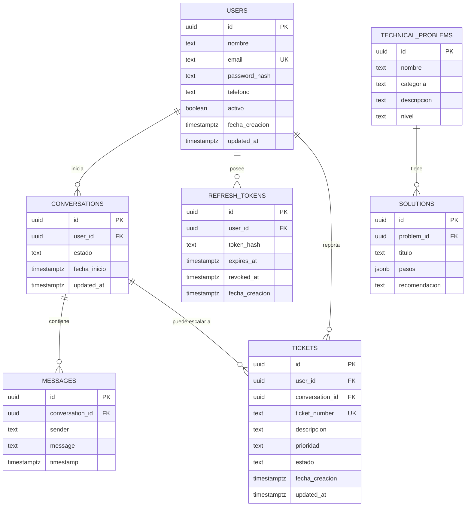

# Modelo de datos — ClickIA (Fase 2)

## 1. Diagrama entidad-relación



## 2. Decisiones de diseño y por qué

- **UUID como PK (`gen_random_uuid()`, extensión `pgcrypto`)** en vez de
  `SERIAL`: evita enumeración de IDs en la API (`/tickets/1`, `/tickets/2`,
  ...), que es un riesgo de seguridad (IDOR) real en un sistema con datos de
  usuarios. También facilita escalar a múltiples instancias de escritura en
  el futuro sin colisión de IDs.
- **`refresh_tokens` como tabla propia** en vez de guardar el refresh token
  dentro de `users`: permite múltiples sesiones activas por usuario (móvil +
  web), revocación individual (`revoked_at`) sin invalidar todas las
  sesiones, y expiración controlada. Nunca se guarda el token en texto plano,
  solo su hash (`token_hash`), igual que las contraseñas.
- **`estado` / `sender` / `nivel` / `prioridad` como `TEXT` + `CHECK`** en vez
  de `ENUM` nativo de Postgres: los `ENUM` de Postgres son costosos de
  modificar (`ALTER TYPE ... ADD VALUE` tiene restricciones dentro de
  transacciones). Un `CHECK` se reemplaza con una migración simple.
- **`solutions.pasos` como `JSONB`** en vez de texto plano: el frontend
  necesita renderizar los pasos como una lista/checklist (ver sección de
  diagnóstico visual del prompt original). Guardar `["Revise las luces del
  router", "Reinicie el equipo", "Compruebe los cables"]` como JSONB permite
  iterarlo directamente sin parsear texto libre.
- **`tickets.ticket_number`** (ej. `TCK-000123`) separado del `id` UUID:
  es lo que se le muestra al usuario ("tu ticket es TCK-000123"); un UUID no
  es memorable ni comunicable por teléfono. Se genera con una secuencia
  (`ticket_seq`).
- **`ON DELETE RESTRICT` en las FKs hacia `users`**: los usuarios se
  desactivan (`activo = false`), nunca se borran físicamente, así que un
  borrado accidental que arrastre en cascada conversaciones/tickets no debe
  poder ocurrir. `messages` sí usa `CASCADE` respecto a `conversations`
  porque un mensaje no tiene sentido sin su conversación.
- **`TIMESTAMPTZ` en todas las fechas**: evita ambigüedad de zona horaria,
  importante si el ISP opera en más de una región.
- **Índices** en toda FK y en las columnas usadas para filtrar (`users.email`,
  `conversations.estado`, `tickets.estado`, `technical_problems.categoria`).

## 3. Tablas y su rol en el flujo RAG

`technical_problems` + `solutions` son la base de conocimiento que el
`RAG Service` (Fase 4) consulta antes de llamar al LLM. `conversations` y
`messages` dan contexto de la conversación en curso y quedan como historial
auditable. `tickets` es el "escape hatch" cuando el flujo automático no
resuelve el caso.

## 4. Migraciones

Las migraciones viven como SQL plano y numerado en
`backend/src/database/migrations/` (se aplican en orden alfabético/numérico).
El seed de la base de conocimiento está en
`backend/src/database/seeds/001_technical_problems_and_solutions.sql`.

En Fase 3 se integrará un runner de migraciones (`node-pg-migrate`) como
script `npm run migrate` dentro del backend. Por ahora, para probar el modelo
de forma aislada con un Postgres local o en Docker:

```bash
createdb clickia_dev

for f in backend/src/database/migrations/*.sql; do
  psql -d clickia_dev -f "$f"
done

psql -d clickia_dev -f backend/src/database/seeds/001_technical_problems_and_solutions.sql
```

**Verificación:**

```sql
\dt                                   -- lista las 7 tablas creadas
SELECT nombre, categoria FROM technical_problems;   -- debe devolver 6 filas
SELECT titulo, pasos FROM solutions LIMIT 1;         -- pasos debe verse como array JSON
```
